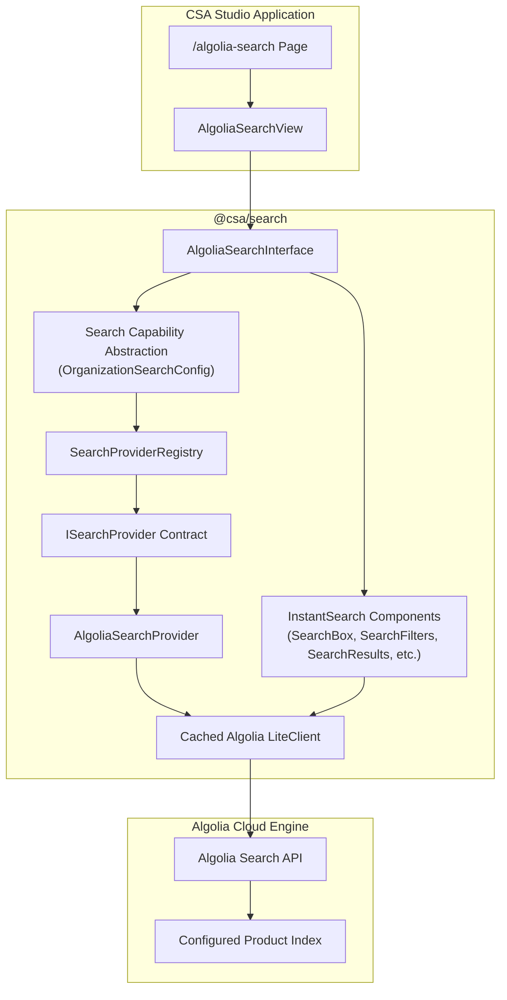

# Algolia Search Capability Architecture

## 1. Overview

The **Algolia Search** capability provides high-performance, intelligent catalog search within the Customer Service Accelerator (CSA). Built on top of official Algolia React InstantSearch and rendered using CSA's design system (`@csa/ui`), it delivers instant query execution, multifaceted filtering, numeric ranges, highlighting, and dynamic schema resilience without hardcoding customer data structures or leaking credentials.

The feature is decoupled from CSA's core commerce layers through a provider-contract abstraction (`@csa/search`), ensuring Algolia acts as a pluggable search provider rather than a hardwired application dependency.

---

## 2. Architecture & Data Flow



---

## 3. Core Principles

1. **Pluggable & Replaceable**: The search capability communicates exclusively through the `ISearchProvider` interface. Algolia is the default initial provider, but additional providers (e.g. backend Elasticsearch, OpenSearch, etc.) can be introduced seamlessly.
2. **Strict Credential Isolation**: Only the search-only API key is exposed to the browser (`NEXT_PUBLIC_ALGOLIA_SEARCH_API_KEY`). Write keys and admin credentials are strictly forbidden in client-side code and runtime bundles.
3. **Dynamic Schema Compatibility**: Hits and catalog attributes are normalized through a resilient field-mapping layer (`normalizeSearchResultItem`), enabling instant compatibility with diverse customer product schemas (e.g. `title` vs. `name` vs. `productName`).
4. **Organization-Level Multi-Tenancy**: The search capability can be enabled, disabled, or configured on an organization/tenant level via `OrganizationSearchConfig`.
5. **No Interference with Existing Workflows**: CSA's native Commercetools product catalog and existing search implementations remain completely intact.

---

## 4. Configuration

### Environment Variables

Search settings are driven by environment variables:

```env
# Algolia Search Capability (Browser-accessible)
NEXT_PUBLIC_ALGOLIA_APP_ID=
NEXT_PUBLIC_ALGOLIA_SEARCH_API_KEY=
NEXT_PUBLIC_ALGOLIA_INDEX_NAME=
```

> [!IMPORTANT]
> Never commit actual API keys or configure write/admin keys in `NEXT_PUBLIC_*` variables. Only Search-Only API Keys must be used in frontend configurations.

### Organization Configuration Schema

Tenant-specific search behavior can be configured programmatically using `OrganizationSearchConfig`:

```typescript
export interface OrganizationSearchConfig {
  /** Whether search capability is enabled for this organization */
  enabled: boolean;
  /** Active provider identifier, e.g. "algolia" */
  provider: 'algolia' | string;
  /** Primary index to search */
  indexName?: string;
  /** Application ID for search engine */
  appId?: string;
  /** Public search-only API key */
  searchApiKey?: string;
  /** User-friendly search box placeholder text */
  placeholder?: string;
  /** Configured facets for filtering */
  facets?: SearchFacetConfig[];
  /** Configured numeric filters */
  numericFilters?: SearchNumericFilterConfig[];
  /** Configured sort/replica options */
  sortOptions?: SearchSortOption[];
  /** Schema field mapping to normalize hit records */
  fieldMapping?: SearchFieldMapping;
}
```

### Enabling and Disabling Search

When search is disabled for an organization:
```typescript
const orgConfig: OrganizationSearchConfig = {
  enabled: false,
  provider: 'algolia'
};
```
The search UI automatically renders a message stating:
> *"Search is currently unavailable for this organization."*

When enabled and connected, the search interface displays a status indicator displaying the active provider, status, and target index.

---

## 5. Adding Another Search Provider

To add an alternative provider in the future (such as a backend search service or Elasticsearch), follow these steps:

1. **Implement `ISearchProvider`**:
   ```typescript
   import { ISearchProvider, SearchCapabilityState, OrganizationSearchConfig } from '@csa/search';

   export class CustomSearchProvider implements ISearchProvider {
     public readonly id = 'custom';
     public readonly name = 'Custom Search';

     public initialize(config: OrganizationSearchConfig): void {
       // initialize client with config
     }

     public getStatus(): SearchCapabilityState {
       return {
         enabled: true,
         providerId: this.id,
         providerName: this.name,
         status: 'connected',
         searchMode: 'Custom Search'
       };
     }

     public getClient() {
       return this.client;
     }
   }
   ```

2. **Register the Provider**:
   ```typescript
   import { SearchProviderRegistry } from '@csa/search';

   SearchProviderRegistry.getInstance().register(new CustomSearchProvider());
   ```

3. **Switch Organization Configuration**:
   Update the organization's search configuration:
   ```typescript
   {
     enabled: true,
     provider: 'custom'
   }
   ```
   The CSA search UI will interact through the unified contract without requiring UI rewrites.
