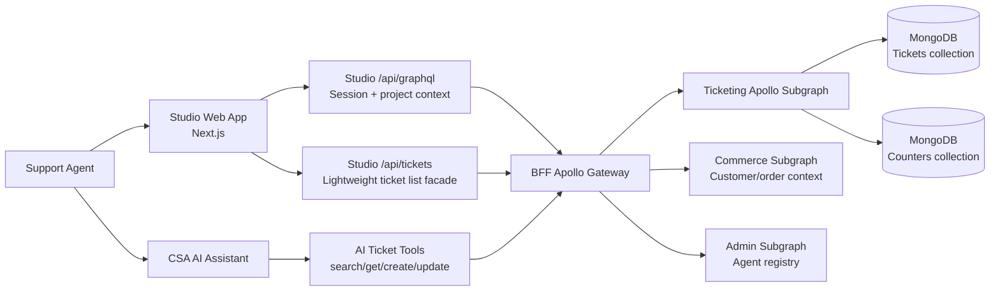

# CSA Ticketing Service

## Overview

The CSA Ticketing Service is the support case management layer for the Customer Service Assistant platform. It lets customer service agents create, search, triage, assign, update, and resolve customer support tickets from the Studio application and from the AI assistant workflow.

The service is designed for commerce support teams that need customer context, order context, internal notes, ownership, and ticket history in one place. Tickets are scoped by project so each client or workspace only sees its own support data.

## What The Ticketing Service Does

- Creates support tickets for customer issues, order inquiries, returns, refunds, technical support, account management, and general inquiries.
- Links tickets to customer records using email and customer ID.
- Links order-related tickets to commerce orders.
- Supports assignment to agents from the agent registry.
- Tracks status, priority, category, source channel, subject, message, attachments, solution notes, and internal worklogs.
- Exposes ticket data to the Studio dashboard, Customer 360 pages, and the CSA AI Assistant.
- Provides project-level data isolation using the active project context.

## User-Facing Workflow

### 1. Ticket Creation

Agents can create a ticket from the Tickets area or directly from a customer profile.

The create flow captures:

- Customer email
- Linked customer ID, when available
- Contact channel: Email, Phone, Chat, Web, Social
- Ticket category
- Related order number for order-linked categories
- Priority
- Assignee
- Subject
- Issue description
- Attachments as file links
- Initial internal worklog notes

After submission, the ticketing service assigns a unique ticket number and stores the ticket in MongoDB.

### 2. Ticket Queue And Search

The Tickets page shows a searchable and filterable queue. Agents can filter by status and priority, search by ticket number, email, subject, or all fields, and sort ticket rows in the UI.

The Customer 360 page also shows tickets related to a specific customer by querying tickets with the customer email.

### 3. Ticket Detail And Workflow

The detail page gives agents a full working view of a ticket:

- Conversation summary and original customer message
- Linked customer information
- Linked order information
- Internal notes
- Ticket history
- Workflow controls for assignee, status, priority, and resolution notes
- Quick actions such as assign to me, escalate, and resolve

Supported UI statuses are:

- Open
- In Progress
- Pending
- Resolved
- Closed

Supported UI priorities are:

- Low
- Medium
- High
- Urgent

### 4. AI Assistant Ticket Actions

The CSA AI Assistant can search, read, create, and update tickets through governed tools. Write actions are permission checked and approval gated, so the assistant cannot create or update tickets unless the current user has the correct capability and the action has been approved where required.

## Architecture

The ticketing system is implemented as an Apollo Federation subgraph. Studio and AI Assist do not call the ticketing service directly; they call the BFF gateway, which forwards the request to the ticketing subgraph with project and user context headers.

## Request Flow

### Read Ticket List

1. Agent opens the Tickets page in Studio.
2. Studio runs a GraphQL `ticketPage` query through `/api/graphql`.
3. The Studio API route validates the session and forwards project/user context to the BFF.
4. The BFF forwards the request to the ticketing subgraph.
5. The ticketing service queries MongoDB for tickets in the active project.
6. Results are returned to Studio and rendered in the ticket queue.

### Create Ticket

1. Agent fills the ticket creation form or starts a create-ticket flow in the AI Assistant.
2. The client sends a `createTicket` GraphQL mutation to the BFF.
3. The BFF forwards the mutation to the ticketing subgraph with project context.
4. The ticketing service generates a ticket number using a MongoDB-backed counter.
5. The ticket is inserted into MongoDB.
6. The created ticket is returned with its ID and ticket number.

### Update Ticket

1. Agent changes assignment, status, priority, or solution notes.
2. Studio sends an `updateTicket` mutation.
3. The ticketing service validates the project scope and updates allowed fields.
4. `lastModifiedAt` is refreshed.
5. The updated ticket is returned to the client.

### Add Worklog

1. Agent adds an internal note.
2. Studio sends an `addTicketWorklog` mutation.
3. The ticketing service appends the comment to the ticket's `comments` array.
4. `lastModifiedAt` is refreshed.

## Tech Stack

| Layer | Technology | Purpose |
| --- | --- | --- |
| Frontend | Next.js, React, TypeScript | Studio ticket pages and Customer 360 integration |
| UI | `@csa/ui` | Shared design system components |
| Client data | Apollo Client | GraphQL queries and mutations from Studio |
| API gateway | Apollo Gateway / Federation | Routes GraphQL operations to ticketing, commerce, and admin subgraphs |
| Ticketing backend | Node.js, TypeScript, Apollo Server Subgraph | Ticket GraphQL schema and resolvers |
| Database | MongoDB | Durable ticket storage |
| Ticket numbering | MongoDB atomic counter | Collision-safe sequential ticket numbers per project |
| Logging/context | `@csa/logger`, `@csa/headers` | Request correlation and project/user context propagation |
| AI tooling | Vercel AI SDK tools, Zod schemas | Assistant ticket search/create/update tools |
| Infrastructure | Docker, Terraform, Cloud Run | Containerized service deployment |

## Core Data Model

A ticket contains:

- `id`: MongoDB document ID
- `ticketNumber`: Human-readable ticket number, for example `CSA-20260904-00001`
- `projectKey`: Tenant/project scope
- `customerName`
- `customerEmail`
- `customerId`
- `source`
- `contactType`
- `status`
- `priority`
- `category`
- `subject`
- `message`
- `assignee`
- `createdBy`
- `orderNumber`
- `solution`
- `timeSpentOnTicket`
- `resolutionDate`
- `comments`
- `attachments`
- `history`
- `createdAt`
- `lastModifiedAt`

## Data Isolation

Ticket operations are scoped by the active `projectKey`. Studio derives the active project from the authenticated session and forwards it through `x-csa-project-key`. The BFF forwards that context to the ticketing subgraph. The ticketing service applies the project key to ticket reads and writes.

This prevents one project from reading or updating another project's tickets when requests follow the supported Studio or AI Assist path.

## Reliability And Storage Behavior

In durable environments, tickets are stored in MongoDB. Ticket numbers are generated with an atomic counter, which prevents duplicate ticket numbers during concurrent ticket creation.

For local development only, the service can run without `MONGO_URI` using an in-memory ticket store. This data is temporary and is lost when the process restarts. In production, the service refuses to start without `MONGO_URI` to avoid silent data loss.

## Current Capabilities

- Federated GraphQL ticket service
- MongoDB-backed persistence
- Project-scoped reads and writes
- Unique ticket number generation
- Ticket create, update, list, search, and detail retrieval
- Internal worklog comments
- URL-based attachments
- Customer and order linking
- Studio ticket queue
- Studio ticket detail workflow
- Customer 360 ticket view
- AI Assistant ticket tools with permission checks

## Known Technical Gaps

- Status and priority values are not fully canonicalized across all producers. Studio uses values like `Open` and `Medium`, while AI tools use values like `open` and `normal`. Backend filters currently compare exact strings, so normalization should be centralized.
- The main Studio ticket page currently fetches up to 100 tickets and then filters/paginates in the browser. Larger clients should use server-side filtering, sorting, and pagination.
- Ticket history is initialized when a ticket is created, but normal updates and worklog additions do not append full audit history entries yet.
- `resolutionDate` is exposed in the data model, but the backend does not automatically set it when a ticket moves to `Resolved` or `Closed`.
- Attachments are stored as links. There is no managed upload or virus-scanning flow yet.
- SLA and sentiment fields are shown as placeholders in the UI but are not currently backed by ticketing data.

## Recommended Next Enhancements

- Introduce canonical backend enums for status, priority, category, and contact type.
- Move all ticket list search/filter/sort/pagination to the backend.
- Append audit history entries for every workflow update, assignment change, priority change, and worklog addition.
- Automatically set `resolutionDate` when a ticket is resolved or closed.
- Add attachment upload support with object storage and scanning.
- Add SLA policy fields and SLA breach tracking.
- Add notification events for ticket assignment, escalation, and SLA risk.
- Add repository and resolver tests around project scoping, ticket numbering, filtering, and mutation history.

## Summary

The CSA Ticketing Service is a real, production-oriented ticket management capability integrated across Studio, Customer 360, and the CSA AI Assistant. It is built as a MongoDB-backed Apollo Federation subgraph and accessed through the BFF gateway with project-scoped context. The current implementation covers the core support workflow and has a clear path to enterprise-grade improvements such as canonical workflow states, complete audit history, SLA tracking, and managed attachments.
